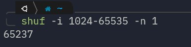
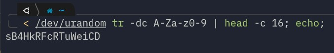

# <h2> This guide explain how to run a shadosocks server on docker </h2>

1. Generate a random port with this command: <strong> `shuf -i 1024-65535 -n 1`  </strong> replace it in "server_port" section in config.json file 
     
2. Generate a strong passowrd with command: 
 <strong>`< /dev/urandom tr -dc A-Za-z0-9 | head -c 16; echo;` </strong> replace the output in password section of config.json, you can use any 16-character password you like as long as it has lowercase and uppercase letters along side numbers.    
   
3. Create proper directory with command:
  <strong>`sudo mkdir /etc/shadowsocks-rust`</strong>

4. Copy edited config.json to the folder that you've just created: 
 <strong> `copy config.json /etc/shadowsocks-rust`</strong>

5. Open the generated port on firewall: 
  <strong>`sudo ufw allow <port number>/tcp`   `sudo ufw allow <port number>/udp`</strong>

6. Execute the docker-compose file:
  <strong>`docker-compose up -d`</strong>
you can can also use the command bellow the command bellow:
  <strong>`docker run -d -p <port number>:<port number> -p <port number>:<port number>/udp --name ss-rust --restart=always -v /etc/shadowsocks-rust:/etc/shadowsocks-rust teddysun/shadowsocks-rust`</strong>
 
<strong>`the following steps are optional and you can use the vpn only one foreign server shadowsocks client like shadowsocks-electron`</strong>
 
7. Now ssh into iran server and from there ssh into your foreign server one time in other to add its fingerprint into known host file.

8. Edit the <strong><code>tunnel.sh</code></strong> file and replace these properties correctly: 

   - `<iran server port>` with generated port, in our case it was <strong>`<port number>`</strong> (Iran server port could be different but for simplicity we use the same port)
   - `<foreign server port>` with generated port, in our case it was <strong>`<port number>`</strong>
   - `<user>` with username on foreign server with which we can ssh into foreign server.
   - `<foreign server public ip address>` with public ip address of foreign server.

9. The final command should be something like this:   <strong> `ssh -4 -f -N -o GatewayPorts=true -L <port number>:0.0.0.0:<port number> ubuntu@192.168.1.1`</strong>

10. Make the <strong><code>tunnel.sh</code></strong> executeable with:  `chmod +x tunnel.sh`

11. Run the script it will run in the background and you should get a message like: <strong>SSH Tunnel has been created successfully!</strong>

12. Add script to crontab so when server restarts, it automatically create ssh tunnel:

    - Run <strong>`crontab -e`</strong>
    - Put the <strong>`tunnel.sh`</strong> in your home folder.
    - add line below to crontab: <strong> `@reboot ~/tunnel.sh >> ~/tunnel.log 2>&1`</strong>

13. Now connect the client with ip address of iran server with generated port and generated password.
14. you can use <a href="https://github.com/nojsja/shadowsocks-electron">this link</a> for shadowsocks client.
